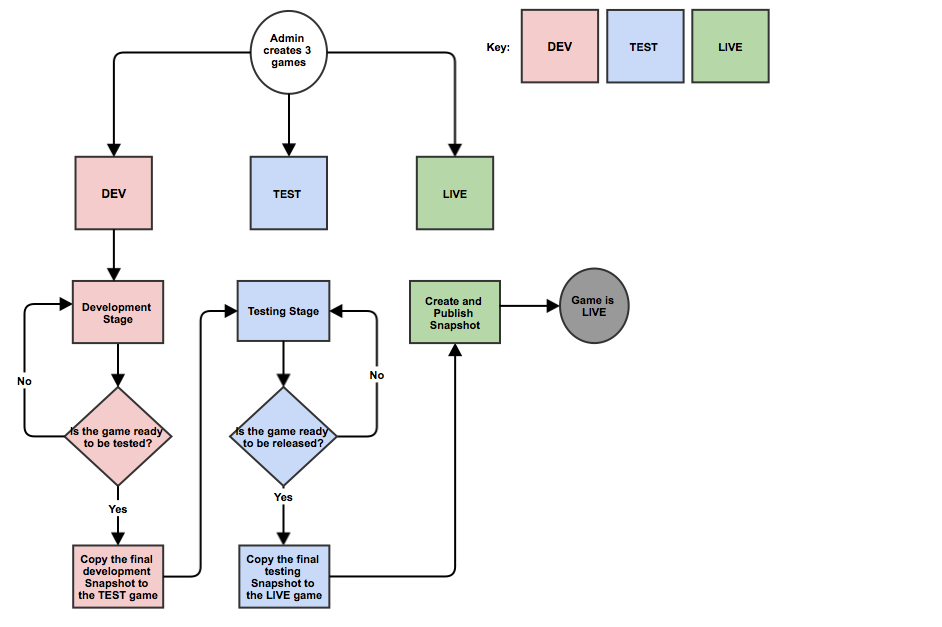

# Multi-Stage Publishing

Sometimes it's not enough to have just a Preview and LIVE environment, and you may want some intermediate environment for testing before the configuration is published to LIVE. This tutorial explains how you can achieve this, and make your game more robust. The diagram below shows you how to easily manage your game.

*1.*  Firstly, we create 3 separate games ( or more, if this is the case for you ) - a *Developer*, *Test* and *LIVE* version:

<q>**Note**: Each version of the game can have unique permissions added, to it.  This will allow or prevent team members from editing the content in the games configuration for a particular stage within our life cycle.  You can read more on permissions [here](/Tutorials/Capabilities/README.md).</q>

*2.*  Once your development stage is complete and you are ready for the testing stage, you can then create a new Snapshot within the *DEV* game that will be copied into the *TEST* game for testing.

 

 *3.*  When copying our *DEV* game's Snapshot into *TEST*, we select our *TEST* game to copy the *Game Configuration* and *Include metadata collections* (optional).

 

 You will notice that an "AUTOSAVE" Snapshot is automatically created on the *TEST* game which saves the game's state before the copy was done.  However, this is not needed as we only want the exact same state as the *DEV* game.

 *4.*  When testing is complete and you are ready to go *LIVE*, you can repeat the copy process from the *TEST* game to the *LIVE* game then publish the *LIVE* version of the game.

<q>**Highly Recommended!** As a rule of good practice, it's highly recommended that you follow this process in the future when creating games.  This helps to keep stages organized and protected from differences in the configuration between the separate stages of the game's life cycle.</q>
