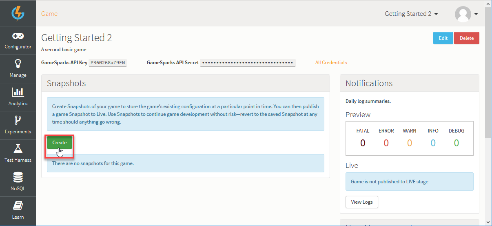
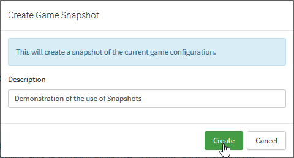
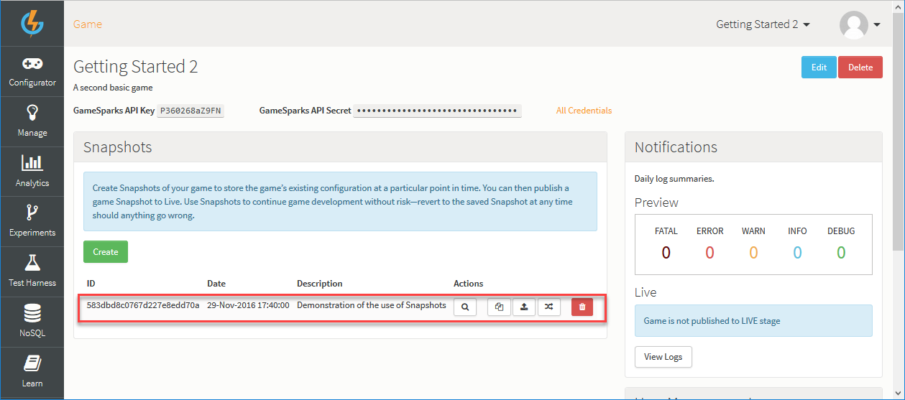

# Versioning and Publishing

## Versioning

You can create versions of your game configuration whenever you like. There are a number of reasons you might want to create a version, including:

  * When you want to publish your game to the Live servers.
  * You've just finished a feature and the game is working exactly as you like. You're moving on to something new but want to be able to fall back on the existing configuration in case anything goes wrong.
  * You want to maintain a couple of configurations and publish them at different times (for example, you have a weekend configuration of the game with 'weekend offer' prices).

You create a version by taking a *Snapshot* of your game's configuration:
* The process collects all your configuration information and stores it in a configuration set.
* This set also contains any data you have in your metadata collections.

<q>**Not Included?** A game configuration Snapshot does not include any Admin Screens configuration you've built up in the Manage section nor any Experiment configuration you've set up.</q>

To create a Snapshot:

*1.* Go to the *Game Overview* page.

*2.* In the *Snapshots* panel, click to *Create* a new Snapshot:

A *Create Game Snapshot* dialog appears.

*3.* Enter a description for the Snapshot - choose something meaningful so you'll be able to identify it in future when you might have multiple Snapshots.

*4.* Click to *Create* the new Snapshot under the entered *Description*. When you've created the Snapshot, it's listed in the *Snapshots* panel in the *Game Overview*:

*5.* From here you can perform the following actions (by clicking on the icons to the right of the description):

*  - Preview the Snapshot. Allows previewing any of the Snapshots without having to revert to them, editing will be disabled when previewing.
*  - Copy the Snapshot. Copies the Snapshot and then you can choose to use it either to overwrite an existing game or create a new one. If you are overwriting, there is a fail-safe - a Snapshot of the previous version is automatically created (called "AUTOSAVE - Pre Copy") which can then be deleted if all is in order.
*  - Publish the Snapshot. This will take the Snapshot and publish the configuration to the live servers. The Snapshot that is currently published is highlighted in green:
  * When you've published a Snapshot, you can use the unpublish  icon button to unpublish the Snapshot. This is especially useful if you've published a Snapshot too early or inadvertently.
  * See [below](#Publishing) for more detail on publishing
*  - Revert the portal to the version contained in the Snapshot. This updates your workspace with the Snapshot version. There is a fail-safe - a Snapshot of the previous version is automatically taken (called "AUTOSAVE - Pre Revert") which can then be deleted if all is in order.
*  - Delete the Snapshot.

<q>**Don't See Publish?** If you're logged into a your own game and the *Publish* is missing, this means you have an Evaluation user account and must upgrade to be able to push your game to the Live stage - see the [Going Live Checklist](/Getting Started/Going Live Checklist/README.md) for how to upgrade your GameSparks user account.</q>

## Mongo Database Collections for Snapshots

When you take a Snapshot, the platform records all of your game's configuration into a configuration set:
  * This *includes* all Metadata Collections and their content.
  * This *excludes* all Runtime and System Collections and their content. These are created new for the Live stage when you *first publish* a game Snapshot and remain untouched when future Snapshots are published.

## Publishing

Once you have configured and tested your game, you'll want to make it available to the public! The testing you have done to this point has been on the Preview servers. These servers allow you to develop your game but are not suitable for use by a significant number of players - there's a limit of 100 concurrent connections per game.

<q>**Note:** You should not launch your game using the Preview servers because player devices will not be able to connect when concurrency limits are reached.</q>

When you are ready to launch your game you need to save the configuration in a Snapshot and then publish it to the Live servers. These are designed for massive concurrency and can handle the loads generated when hundreds of thousands of players are playing the game at the same time.

<q>**Going Live Checklist!** Before you attempt to create a Snapshot of your game and publish it to Live, please review the [Going Live Checklist](/Getting Started/Going Live Checklist/README.md) to ensure everything runs smoothly.</q>
